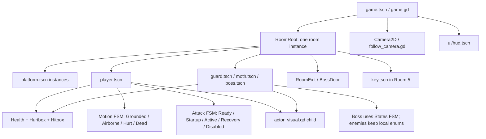
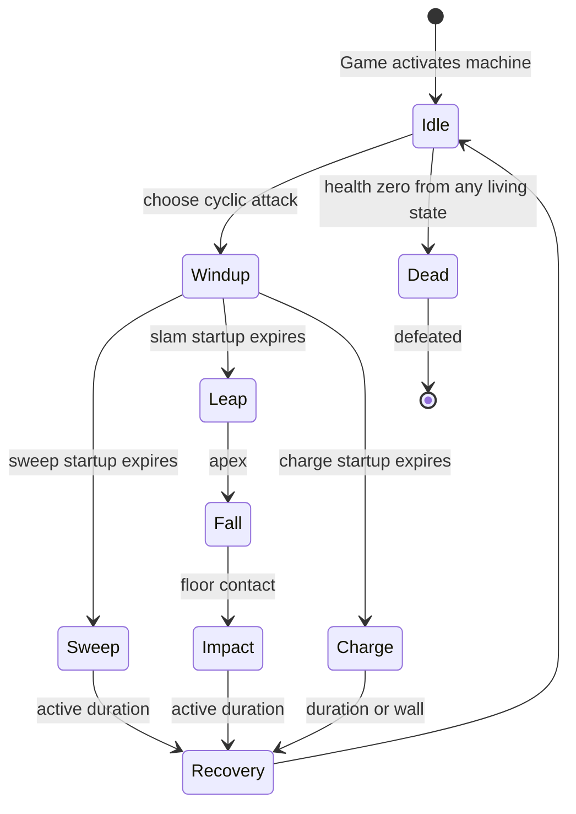
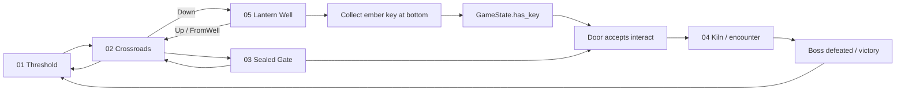

# Architecture reference

Current target: Godot 4.7.2, GDScript, Compatibility renderer, 1152 × 648 logical viewport, 60 physics ticks/second. Earlier versions of this project also passed on 4.6; the current input settings require 4.7.2 for the full suite (see TESTING.md). Runtime dependencies: Godot only.

## Scene composition

Player, guard, moth and boss each compose the same three component scripts. They have separate behavior scripts, not an entity inheritance tree. Visual reads actor state. Gameplay never addresses Visual. Key/door visuals are small enough to stay in their respective interactable scripts.

Game has PROCESS_MODE_ALWAYS to receive pause/restart input. RoomRoot and Camera explicitly use PROCESS_MODE_PAUSABLE, so the always-processing parent cannot accidentally keep gameplay active while paused. HUD remains responsive. Feedback also runs while paused so slow-motion cannot become stuck.

## Components and collision

| Node | Responsibility | Small public API |
|---|---|---|
| HealthComponent | Integer health, clamping, invulnerability, death once | take_damage(amount, impulse) → accepted bool |
| HurtboxComponent (Area2D) | Find sibling Health via health_path and forward a hit | receive_hit(amount, impulse) → bool |
| HitboxComponent (Area2D) | Enabled damage window, overlap checks, one accepted hit per target per swing | begin_swing(), end_swing() |

Hitboxes remain monitoring even while disabled. The enabled flag gates damage, allowing an already-overlapping target to be hit when the active period starts. An accepted hit invokes Feedback and emits hit_landed. Friendly fire is excluded through collision masks.

| Layer number | Bit value | Usage |
|---|---|---|
| 1 | 1 | World geometry |
| 2 | 2 | Player body; exits, key, door scan this |
| 3 | 4 | Enemy/boss bodies |
| 4 | 8 | Player hurtbox; enemy hitboxes scan this |
| 5 | 16 | Enemy hurtboxes; player hitbox scans this |

All CharacterBody2D bodies collide with World only. Passing through an enemy outside its attack is intentional; there is no generic contact damage. Hurtboxes do not scan. Hitboxes do not need to be monitorable by other areas.

## Resources

| Type | Files | Used by |
|---|---|---|
| MovementTuning | resources/movement_tuning.gd, player_movement.tres | Player movement, knockback response |
| AttackData | resources/attack_data.gd | All hitboxes and actor attack timing |
| Attack instances | player_attack, guard_attack, moth_attack, boss_sweep, boss_slam, boss_charge .tres | Respective actor |

Resources store configuration only, never cooldowns, health or hit-target lists. Health maximum is exported on each Health node. Boss Hitbox's RectangleShape2D is local to scene because its dimensions change for each attack.

Moth uses dive_duration for the end of its flight. Its AttackData.active_time is not used to schedule the dive; this is an explicit archetype-specific timing choice. AttackData.recovery is its minimum return cooldown. Player knockback strength/lift are determined by MovementTuning, using the hit impulse for direction; guard/moth use the complete impulse, boss only a small horizontal fraction.

## Autoloads

| Autoload | State / responsibility |
|---|---|
| GameState | has_key, door_unlocked, victory, room_index; collect_key, try_unlock_door, reset_run |
| Feedback | Brief Engine.time_scale reduction, timed restoration, transient impact nodes; impact, clear |

Both are configured in project.godot. Script users resolve them through /root/GameState or /root/Feedback, which also works in the standalone --script test harnesses. Neither writes save files.

Feedback stores remaining freeze duration. Engine.time_scale becomes 0.08, and _process divides its scaled delta by that scale to expire the freeze in unscaled time. clear() restores 1.0 during room changes. Pause is SceneTree.paused and is independent of hit-stop.

## Signals and receivers

| Sender | Signal | Receiver | Purpose |
|---|---|---|---|
| Health | damaged(amount, impulse) | Owning actor | Recoil, flash, state response |
| Health | died | Owning actor | Player retry request, enemy removal, boss defeat |
| Health | health_changed(current, maximum) | HUD for player/boss | Event-driven UI |
| Player | respawn_requested | Game | Reload current entrance after death delay |
| RoomExit / BossDoor | transition_requested(index, spawn) | Game | Deferred room swap |
| GameState | changed | HUD | Key indicator |
| GameState | message_requested(text) | HUD | Collection / locked-gate feedback |
| Feedback | impact_created(position) | FollowCamera; test observer | Subtle shake / freeze assertion |
| Boss | defeated | Game | Set victory and show overlay |
| Hitbox | hit_landed(target) | Available observation hook | Additional hit feedback/experiments; no required listener |
| StateMachine (Motion/Attack/States) | state_changed(previous, current) | FSM tests; optional observer | Debug completed state transitions |

HUD binds once to each new actor and immediately reads its initial health. Old signal connections disappear when the old room's nodes are freed.

## Input and movement

Bindings live entirely in project.godot. Player consumes named actions via Input.get_axis and is_action_just_pressed/pressed. Axis values retain their analog magnitude after the 0.2 action deadzone. Jump grace and buffering track action time, never device buttons. There is no device mode or prompt-detection subsystem.

Player uses floor state from the previous move_and_slide call to refresh grace, updates timers, accelerates toward axis × desired speed, applies rise/fall gravity, consumes buffered jump while grace is available, cuts a released upward jump, and finally calls move_and_slide. Attack movement is 72% speed. Damage interrupts the swing and temporarily locks horizontal steering.

## State lifecycle and player machines

**components/state_machine.gd** owns one current **ActorState** child. initialize(actor, initial_state) sets up child contexts and optionally enters an initial state. change_state(name, restart=false) validates the name, runs exit on the previous state, enters the next, then emits state_changed. A repeated selection is a no-op unless restart is true.

ActorState provides setup, enter, physics_update, after_move and exit hooks, plus a remaining timer field. PlayerState/BossState add typed actor references. States never use automatic _physics_process: the body explicitly ticks its machine. A same-machine transition from enter/exit is rejected to avoid reentrant lifecycle calls; transitions in update/after_move are immediate. Entry effects occur immediately, but a newly entered state normally starts its updates next tick.

Player composes two machines:

| Machine | States | Responsibility |
|---|---|---|
| Motion | Grounded, Airborne, Hurt, Dead | Movement permissions, airborne behavior, control lock, death/retry |
| Attack | Ready, Startup, Active, Recovery, Disabled | Action acceptance and attack lifecycle |

Grounded/Airborne can coexist with any normal attack phase. Hurt/Dead select Attack.Disabled; recovering motion selects Ready. Active.exit disables damage on either normal completion or interruption. Player's dead/attacking/attack_phase properties are derived views, not duplicate mutable state.

Player ticks input/grace/buffer timers, then Attack, then Motion; cuts released upward motion, moves once, and calls Motion.after_move for floor transitions. Hurt counts its control lock locally; Dead counts its respawn delay locally. Shared steering/gravity/jump formulas remain on Player as helpers. Grounded.enter and Airborne.physics_update are the documented extension points for a future double jump; none was added.

Guard and moth retain their compact enum/match FSMs. Splitting their stable behaviors into many files would add indirection without an immediate benefit. They can adopt the same component later if their behavior grows.

## Boss state machine

Boss/States contains one script-backed node for each label above. It initializes without a current state until activate(). boss.gd retains tuning, target/data selection, common physics and health handlers. There is no state-dispatch match block. The Attack enum still selects SWEEP → SLAM → CHARGE data, while attack_states maps each choice to its first execution node (Sweep, Leap or Charge). Windup uses that mapping when startup ends.

Slam records a nearby target clamped to the arena, launches toward it, falls vertically from the apex, then enables a wide ground hitbox. Charge commits to facing. Sweep, Impact and Charge own hitbox enablement in enter and cleanup in exit. Dead entry stops velocity and emits defeated after outgoing cleanup. Nonlethal damage flashes/nudges the boss without cancelling its attack.

Each state's remaining field owns its timer. boss.state, state_remaining, active and dead are read-only machine views for presentation/tests. There is no separate boss state enum or independently writable activity/death flag.

## Room flow and lifetime

Game.ROOMS maps zero-based indices to .tscn paths. Each room has Geometry, Spawns, Player, Enemies, and Exits. Side exits choose Entrance or Return. Room 2 is a junction: Back → index 0 / Return, Forward → index 2 / Entrance, Down → index 4 / Entrance. Room 5 is the lower Lantern Well with the key at floor level and six alternating platforms leading to Up → index 1 / FromWell. Room 2's FromWell marker stands on the right lip of the opening, and Room 5's Entrance stands below its Up trigger, preventing immediate return transitions. Vertical exits reuse room_exit.tscn rotated +/-90 degrees; destination selection is independent of rotation. Only Room 3 has BossDoor. Room 4 has no exits.

Game.request_room defers load_room outside the physics query callback. It detaches and frees the previous room, instances the next, selects its marker, connects every exit's signal, binds HUD and camera, and activates the boss if present. Fresh actors restore health and reset velocity; all enemies reset on re-entry. Key and door flags persist until reset_run or application exit. R/View and death retry the current room at current_spawn (including FromWell), or R/View resets the entire run after victory.

## Tests and boundaries

The tests exercise real scenes and physics. Most focused integration tests position actors to isolate behavior; test_playthrough.gd instead navigates and fights using actions only. Test scripts do not supply runtime gameplay dependencies. See TESTING.md for commands, failures fixed, counts, and manual limits. No external assets, networking, inventory framework, save system, dash, double jump, one-way platforms, or abstract AI framework are present.
