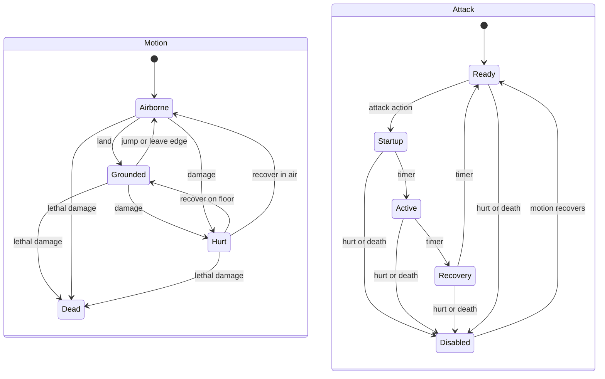

# Learning guide: Cinder Thread

This guide describes the files in this project, not a hypothetical architecture. Open **project.godot**, press **F5**, and play before trying to understand every line. Your first useful experiment is changing one movement value, replaying the movement lab, and noticing the difference.

Paths below begin at the project root; Godot calls that location **res://**. Godot's Inspector exposes fields marked **@export**. A script's default is used unless a scene or Resource overrides it.

## 1. Mental model

```text
GAME (game.tscn)
  └─ one ROOM at a time
	   ├─ platforms and exits
	   ├─ PLAYER
	   │    └─ Health + Hurtbox + Hitbox
	   └─ ENEMIES / BOSS
			└─ the same component scripts

RESOURCES configure behavior.
SIGNALS announce events.
GLOBAL STATE survives room replacement.
INPUT ACTIONS describe the player's intent.
```

The Game scene coordinates the experience. It does not calculate jump velocity or guard attacks. A room places entities and geometry. Each entity owns its behavior and composes smaller nodes for repeated jobs. Data lives in Resources when sharing/editing that data is useful.

For example, the player and the boss both have health. They respond differently to losing health, but subtracting damage, rejecting repeated hits, and announcing death are the same job. HealthComponent handles that shared job; each actor decides how to react.

The key is different: its node disappears when collected, but the fact that you own it must survive. That fact lives in the GameState autoload, outside every room.

## 2. Project structure

| Location | Why it exists |
|---|---|
| project.godot | Engine settings, main scene, named inputs, autoloads, collision layer names |
| game.tscn / game.gd | Persistent room coordinator, camera and HUD |
| player/ | Player body/input helpers; states/ contains movement and attack state scripts |
| enemies/ | Independent ground guard and flying moth scenes/scripts |
| boss/ | Kiln Warden body/configuration; states/ contains each boss behavior |
| components/ | Shared Health/Hitbox/Hurtbox plus the small ActorState and StateMachine lifecycle |
| resources/ | MovementTuning and AttackData classes plus editable .tres instances |
| rooms/ | Five hand-authored room scenes, reusable platform, background and camera scripts |
| interactables/ | Key, ordinary exit, and boss gate |
| ui/ | HUD, pause and victory presentation |
| effects/ | Procedural actor drawing and short impact bursts |
| autoload/ | Run state and global impact feedback |
| tests/ | Movement lab, automated harnesses, PowerShell runner, rendered-capture scene |
| docs/ | This guide, architecture reference, testing record, development history |
| logs/ | Generated local test logs; not required to play |
| tests/artifacts/ | Generated screenshots; ignored by Godot's importer and version control |
| .godot/ | Generated engine cache; not authored game code |

The small .gd.uid files are Godot's identifiers for scripts. Keep them with their scripts when sharing the project. You do not need to edit them.

## 3. Scene trees you can inspect

Open **player/player.tscn**:

```text
Player (CharacterBody2D, player.gd)
├─ Body (CollisionShape2D)
├─ Visual (Node2D, actor_visual.gd; kind = player)
├─ Health (Node, health_component.gd)
├─ Hurtbox (Area2D, hurtbox_component.gd)
│  └─ Shape (CollisionShape2D)
├─ Hitbox (Area2D, hitbox_component.gd)
│  └─ Shape (CollisionShape2D)
├─ Motion (StateMachine)
│  ├─ Grounded
│  ├─ Airborne
│  ├─ Hurt
│  └─ Dead
└─ Attack (StateMachine)
   ├─ Ready
   ├─ Startup
   ├─ Active
   ├─ Recovery
   └─ Disabled
```

The root is at the player's feet. Body extends upward 40 pixels. Body collides with platforms. Hurtbox is the region that can receive damage. Hitbox is the region that can deliver damage during an attack. These three collision purposes are separate.

Open **enemies/guard.tscn**:

```text
Guard (CharacterBody2D, guard.gd)
├─ Body
├─ Visual (kind = guard)
├─ Health
├─ Hurtbox / Shape
├─ Hitbox / Shape
└─ EdgeProbe (RayCast2D)
```

EdgeProbe points down just ahead of the guard. The guard stops at an unsupported edge rather than blindly falling off its patrol platform. Each guard scene instance may override patrol_radius or Health.max_health independently.

Open **enemies/moth.tscn**:

```text
Moth (CharacterBody2D, moth.gd)
├─ Body
├─ Visual (kind = moth)
├─ Health
├─ Hurtbox / Shape
└─ Hitbox / Shape
```

Moth has the same components but supplies its own flying velocity. It does not inherit guard.gd, use gravity, or need an edge probe.

Open **boss/boss.tscn**:

```text
Boss (CharacterBody2D, boss.gd)
├─ Body (larger rectangle)
├─ Visual (kind = boss)
├─ Health (24 maximum)
├─ Hurtbox / Shape
├─ Hitbox / Shape (local-to-scene rectangle)
└─ States (StateMachine)
   ├─ Idle
   ├─ Windup
   ├─ Sweep
   ├─ Leap
   ├─ Fall
   ├─ Impact
   ├─ Charge
   ├─ Recovery
   └─ Dead
```

One boss hitbox changes size and position for the three attacks. Its Shape Resource is local to scene so changing this instance does not accidentally resize another instance's hitbox.

Open **rooms/room_2.tscn**:

```text
Room2 (Node2D, room.gd)
├─ Geometry
│  ├─ Floor / LeftWall / RightWall (platform.tscn instances)
│  └─ Ledge1 / Ledge2 / Ledge3
├─ Spawns
│  ├─ Entrance (Marker2D)
│  └─ Return (Marker2D)
├─ Player (player.tscn instance)
├─ Enemies
│  ├─ Guard1
│  └─ Guard2
├─ Exits
│  ├─ Back
│  └─ Forward
└─ Key
```

Room 1 has one guard and a forward exit. Room 3 has the flying moth, a back exit, and BossDoor under Exits. Room 4 has the boss and an empty Exits node. Its physical walls and absence of an exit keep the encounter contained.

The **platform.tscn** scene has a StaticBody2D root and CollisionShape2D child. Its @tool script updates the rectangle and drawing when you change size in the Inspector. Platforms are solid on every side.

## 4. Player state machines and movement

Start with **player/player.tscn**, **components/state_machine.gd**, and **player/states/grounded.gd**. The state nodes visible in the scene are the actual runtime states. Their filenames describe their jobs.

The original enum plus match implementation was already an FSM. This version gives each state its own script and a consistent lifecycle so adding behavior does not expand a central dispatch block. Conditions still exist for decisions such as "did the timer expire?" or "did the body land?" An FSM organizes those decisions; it does not eliminate them.

### A small shared lifecycle

**ActorState** extends Node and declares five hooks. **StateMachine** keeps one current child state and delegates to it.

| Hook | When it runs | Example |
|---|---|---|
| setup(actor) | Once, during machine initialization | PlayerState stores a typed Player reference |
| enter() | Once when selected | Active enables its hitbox and initializes duration |
| physics_update(delta) | Each tick while current | Airborne applies steering/gravity and checks a buffered jump |
| after_move() | When the actor calls it after move_and_slide | Airborne notices landing and requests Grounded |
| exit() | Once before another state becomes current | Active disables its hitbox, even when interrupted |

**change_state(&"Airborne")** looks up the child with that name, calls the old state's exit(), selects the new state, calls enter(), then emits state_changed(previous, current). Selecting the current state is a no-op unless restart is explicitly true. Hurt uses a restart for a fresh accepted hit. Unknown state names fail an assertion rather than silently doing nothing.

States have **physics_update**, not Godot's automatic **_physics_process** callback. Only the actor ticks the machine, so inactive states never run accidentally and update order is explicit. Do not call another transition on the *same machine* inside enter/exit: the machine asserts against that reentrancy. Request transitions in physics_update/after_move instead. A motion state's enter may change the separate attack machine.

PlayerState and BossState are small typed context adapters. They do not add another behavior framework. There is no global state manager, transition graph editor, signal bus, or hierarchy of actor base classes.

### Why the player has two machines



An airborne player can also be attacking. Making those mutually exclusive would either remove air attacks or create combinations such as AirborneAttacking and GroundedAttacking. Two small machines let each concern stay independent.

Motion controls whether steering/jumping is allowed. Hurt disables the Attack machine; Grounded/Airborne restore Ready on recovery. Normal ground/air transitions preserve a running attack. Dead disables attacks and eventually requests a respawn. The properties **dead**, **attacking**, and **attack_phase** are derived from current states rather than separately writable flags that could disagree with them.

### One physics tick

Read **player.gd → _physics_process(delta)**:

1. Decrease the damage flash timer. If Dead, tick that state for its respawn delay and return.
2. **read_input(delta)** samples the movement axis, refreshes/decreases coyote grace, decreases jump buffering, and records a new jump action.
3. Tick **Attack**. An accepted attack can select facing and start Startup.
4. Tick **Motion**. Its current state chooses which movement helpers run.
5. **cut_released_jump()** caps upward velocity when jump is not held.
6. Position the attack area, call **move_and_slide()** exactly once, then call Motion.after_move() to react to the collision result.

The engine still runs at 60 physics ticks per second. State nodes do not introduce a second physics loop.

**Grounded.physics_update()** calls steer(delta, true), then tries the buffered ground jump. Launching switches to Airborne. Its after_move() also switches to Airborne when walking off an edge.

**Airborne.physics_update()** calls steer(delta, false), applies gravity, and tries a buffered jump using any remaining coyote grace. Its after_move() switches to Grounded on landing. A buffered landing jump is consumed on the next physics tick, preserving the original behavior.

**Hurt.physics_update()** counts down the configured knockback recovery. During the lock it applies gravity but never calls steer or tries jumping. When the timer expires it selects Grounded/Airborne and lets that state handle the recovery tick.

**Dead.physics_update()** counts down its exported respawn_delay and emits respawn_requested once. There is no asynchronous state callback left running after a transition.

### Shared movement helpers

The physics calculations remain on Player, where states can call them without duplicating formulas:

- **steer(delta, grounded)** accelerates toward axis × desired speed. It selects ground acceleration, braking or turning rates, or air acceleration/braking.
- **apply_gravity(delta)** uses normal gravity while rising, fall_multiplier while descending, and terminal_velocity as the downward cap.
- **try_buffered_jump()** requires both a buffered input and coyote grace; it returns whether it launched.
- **launch_jump()** sets the upward velocity and consumes the jump buffer/grace.
- **cut_released_jump()** caps released upward motion, including a buffered tap released before landing.

Velocity is in pixels/second; negative Y is up. Input.get_axis retains analog magnitude. Keyboard input asks for full speed; a partial stick asks for less. move_toward applies acceleration × delta so speed changes remain time-based.

Coyote time remains 0.11 seconds, jump buffer 0.12 seconds, falling gravity multiplier 1.55, and terminal speed 850. The held/tapped jump measurements remain **116.91 / 37.21 pixels** after this refactor. Movement during a swing remains 72% speed. All tuning still lives in player_movement.tres.

### Where you would add double jump

Double jump is intentionally **not implemented**. A straightforward extension has a small landing-reset counter and an airborne input decision:

1. Keep a per-player remaining-air-jumps counter as runtime data, not in the shared MovementTuning Resource.
2. Reset the allowance in **Grounded.enter()**. Decide explicitly whether recovering from Hurt on the floor should also reset it.
3. In **Airborne.physics_update()**, first try the existing coyote jump. If that succeeded, do not also consume an air jump.
4. For a new jump press that was not a coyote jump, check/decrement the allowance and use **launch_jump()**. Decide whether air jumps should accept buffered inputs or only a fresh press.
5. Keep release-to-cut behavior and ordinary landing transitions. Add checks for one extra jump, no third jump, allowance reset on landing, and coyote jumping not spending the allowance.

You do not have to invent a DoubleJump state if it is only a second upward impulse with the same air controls. A dedicated state makes sense if it has a distinct duration or movement rules. The existing Airborne state is the extension point either way.

## 5. Input architecture

Open **Project → Project Settings → Input Map**. The corresponding text lives under **[input]** in project.godot.

| Action | Desktop | Controller |
|---|---|---|
| move_left | A, Left arrow | Left stick left, D-pad left |
| move_right | D, Right arrow | Left stick right, D-pad right |
| jump | Space | South: Xbox A / PlayStation Cross |
| attack | Left mouse | West: Xbox X / PlayStation Square |
| interact | E | North: Xbox Y / PlayStation Triangle |
| pause | Escape | Menu / Options |
| restart | R | View / Share |

The gameplay asks, “Was jump just pressed?” It does not ask, “Was Space pressed?” Space and the south button are two possible sources of the same intention. This is why the same jump buffer works for both devices.

There is no keyboard/controller mode. Godot aggregates actions from their mapped events, and the game reads those actions every tick. Keyboard movement is digital: left/right input has magnitude 1. Stick input is analog after the **0.2 deadzone**. A tested 0.6 stick input becomes roughly 0.5 action strength, producing **142.5 px/s** at the 285 maximum.

The tradeoff is intentional: a small stick tilt gives a short horizontal jump distance. Use a larger tilt for the key-room gaps. Holding opposing digital inputs cancels the horizontal axis. Switching between devices requires no settings change.

To add a binding, expand the action in Input Map, add the desired key/mouse/joypad event, and save the project. Keep gameplay code unchanged. Set the action deadzone there as well. The UI displays both keyboard and Xbox-style labels; it does not dynamically detect the latest device.

Game's **_unhandled_input(event)** handles pause and restart. Player's physics loop handles movement, jump and attack. Door's process callback checks interact while a player is within its Area2D. Tests synthesize device events, but that cannot verify an actual controller's drivers, layout or stick drift.

## 6. Movement tuning

Select **resources/player_movement.tres** in Godot. If a value is not written explicitly in the .tres text, it uses the exported default from **resources/movement_tuning.gd**. Resources are shared data: edit the movement file and all players referencing it receive the change.

| Property (default) | What it controls | Increasing it feels like | Decreasing it feels like |
|---|---|---|---|
| max_speed (285) | Horizontal target at full input | Faster travel, longer running jumps | Slower, more deliberate positioning |
| ground_acceleration (2200) | Speed gained toward input each second | Quicker response from rest | Longer run-up |
| ground_deceleration (2600) | Ground braking without input | More immediate stopping | More slide |
| turn_acceleration (3600) | Braking/reversing when direction opposes velocity | Sharper reversal | Heavier turn |
| air_acceleration (1500) | Horizontal steering in flight | Easier aerial corrections | More committed jumps |
| air_deceleration (650) | Air braking with no input | Less drift when stick/key released | More momentum |
| jump_velocity (-570) | Initial upward speed | Greater magnitude (more negative) jumps higher | Smaller magnitude (closer to zero) jumps lower |
| gravity (1450) | Upward slowdown and basic downward acceleration | Shorter, brisker jumps unless launch is increased | Higher, floatier jumps |
| fall_multiplier (1.55) | Additional gravity while descending | Faster, weightier descent | More time to adjust on the way down |
| terminal_velocity (850) | Maximum downward speed | Faster long falls | More limited fall speed |
| released_jump_speed (220) | Maximum upward speed after releasing jump | Taps retain more height | Taps cut upward motion harder |
| coyote_time (0.11) | Grace after leaving floor | More forgiving edge jumps | More precise edge timing required |
| jump_buffer_time (0.12) | How long early jump input waits | Easier jumps on landing; excessive values feel surprising | Tighter input timing required |
| attack_move_multiplier (0.72) | Fraction of run speed during attack | More mobile offense | More committed offense |
| knockback_strength (330) | Player horizontal recoil magnitude | Stronger displacement on damage | Less displacement |
| knockback_lift (220) | Player upward recoil magnitude | Higher damage bounce | Flatter recoil |
| knockback_recovery (0.18) | Seconds before steering returns | Longer loss of control | Faster recovery |

For jump_velocity, the signed numeric direction is easy to confuse: changing -570 to -650 increases *upward magnitude* and height; changing it to -450 reduces height.

Use this tuning loop: run **tests/movement_lab.tscn** with F6; observe one motion; change one parameter; repeat the same motion. First tune running/stopping, then held jump, then falling, then forgiving input windows. Do not change five values at once and try to guess which one helped.

The lower key room uses a 90 pixel first ledge and then 80 pixel rises, alternating left and right. If you substantially lower jump height, those rises may become unreachable. **test_playthrough.gd** catches that regression using the actual platforms.

## 7. Components: why reuse helps here

**HealthComponent** solves one recurring problem: every combatant needs sensible health, accepted damage, a brief invulnerability interval, and a single death announcement.

A beginner might put current_health -= damage separately in four actor scripts. That works initially, but then each copy needs zero clamping, protection against repeated area overlap, and UI notifications. Copies drift apart as bugs are fixed in only one.

Here, all four Health nodes attach **components/health_component.gd**. They keep separate runtime values, while sharing code. Their scene exports differ: player has 6 health and 0.85 seconds of invulnerability; guard has 3, moth 2, boss 24. Non-player health uses the component's 0.12-second default immunity.

**take_damage(amount, impulse)** returns false for non-positive damage, dead health, or active invulnerability. Otherwise it clamps applied damage to remaining health, starts immunity, emits health_changed and damaged, and emits died at zero. A later hit cannot make health negative or emit died again.

Player's damaged handler cancels its attack, flashes, recoils, and locks control. Guard enters HURT; moth briefly recoils before returning home; boss flashes and accepts a small horizontal nudge without abandoning its attack. Each actor connects its own signals in _ready().

**HurtboxComponent** solves “where can this entity be struck?” It is an Area2D with a shape and a health_path pointing to ../Health. Its **receive_hit()** forwards damage and impulse to Health. A beginner could put damage handling inside each enemy's area_entered callback, but that would duplicate routing.

**HitboxComponent** solves “when and whom does this attack hit?” Its **begin_swing()** clears prior targets and enables damage. **end_swing()** disables it. While enabled, **_physics_process()** examines overlapping HurtboxComponents, computes an outward impulse, and asks receive_hit(). Only accepted hits enter the target list and create feedback.

Polling overlaps matters: a target may already be inside the area before the active period starts. Merely listening to area_entered while active could miss that target. Remembering accepted targets prevents one 0.13-second swing from inflicting damage on every physics tick.

The player's hitbox scans enemy hurtboxes. Enemy and boss hitboxes scan the player's hurtbox. Collision masks implement this distinction; no faction framework is needed.

## 8. Node versus Resource versus scene versus script versus signal

| Concept | Actual example | What it means here |
|---|---|---|
| Node | Player/Health in the running SceneTree | One live health component with its own current health and timer |
| Resource | resources/player_movement.tres | Shared configuration object containing numbers; not a SceneTree entity |
| Scene | player/player.tscn | Saved composition of root body, collision, visual, health and attack areas |
| Script | player/player.gd | Behavior attached to the root CharacterBody2D |
| Signal | Health.damaged | An announcement that connected listeners can respond to |

**movement_tuning.gd** defines a Resource type. **player_movement.tres** is a saved instance of that type. **player.gd** holds a reference to that instance. Its velocity and countdowns are runtime state and belong to the Player node.

A PackedScene is itself a Resource representing a saved hierarchy. Calling instantiate() creates live Nodes from it. Game does that for rooms; the room scene already contains instances of reusable actor/platform scenes.

Scripts and nodes are not interchangeable. health_component.gd is a reusable definition; the player's Health and the boss's Health are two live nodes using that definition.

Do not put current health in a shared .tres. Two enemies referencing the same Resource would then unintentionally share mutable health. This project deliberately exports maximum health on each Health node and initializes current health on _ready().

## 9. Signals and who listens

| Sender | Signal | Receiver | Purpose |
|---|---|---|---|
| Health | health_changed(current, maximum) | HUD, for current player/boss | Update health display only when health changes |
| Health | damaged(amount, impulse) | Actor owning that Health | Decide recoil, flash and state response |
| Health | died | Owning actor | Decide what that entity's death means |
| Player | respawn_requested | Game._on_respawn | Request a room retry after the death delay |
| RoomExit / BossDoor | transition_requested(destination, spawn_name) | Game.request_room | Request travel without owning the loader |
| GameState | changed | HUD._update_key | Refresh the key indicator |
| GameState | message_requested(text) | HUD.show_message | Show pickup/locked feedback |
| Feedback | impact_created(position) | Camera._on_impact | Trigger a short subtle shake |
| Boss | defeated | Game._on_boss_defeated | Mark and display victory |
| Hitbox | hit_landed(target) | Optional observer; none required | A small hook for future hit effects or debugging |
| Player Motion/Attack and Boss States | state_changed(previous, current) | Optional observer; FSM tests | Observe completed transitions without controlling them |

For example, Health does not call $"/root/Game/HUD".update_bar(). That would make Health depend on a particular game's UI path. It emits health_changed; HUD chooses to subscribe.

Similarly, an exit does not remove the room itself. It announces a destination; Game owns the lifecycle. Signals reduce those dependencies. Direct method calls are still useful for commands: Game calls HUD.bind_player(), and Hitbox calls Hurtbox.receive_hit() because it needs a synchronous accepted/rejected result.

## 10. Complete player attack flow

Trace **player/states/attack_ready.gd**, then Startup, Active, and Recovery:

1. Mouse left or the west button activates the **attack** input action.
2. Player ticks its Attack machine. Only **attack_ready.gd → physics_update()** accepts a new attack press.
3. It requests Startup. **attack_startup.gd → enter()** locks facing from current movement input and loads the 0.07-second startup timer.
4. **actor_visual.gd → draw_player()** reads the derived attack_phase name and pulls the weapon back.
5. Startup's timer selects Active. **attack_active.gd → enter()** loads the 0.13-second timer and calls Hitbox.begin_swing().
6. HitboxComponent._physics_process() finds an overlapping enemy Hurtbox and calls receive_hit().
7. Hurtbox forwards damage to Health.take_damage().
8. Health updates health and emits health_changed, damaged and, if needed, died.
9. The enemy/boss's _on_damaged() supplies its own reaction.
10. Hitbox records the accepted target, emits hit_landed, and invokes Feedback.impact(). Feedback briefly slows time, draws impact rays and signals the camera.
11. When Active's timer expires, the machine calls **Active.exit()**, which disables the hitbox, then **Recovery.enter()**, which starts the 0.19-second recovery.
12. Recovery returns to Ready; another press can begin a swing.

Damage or death can switch Attack directly to Disabled. Crucially, that still calls Active.exit(), so cancellation cannot leave a damaging hitbox enabled. Startup/Recovery are harmless and can be cancelled through the same lifecycle.

Movement continues through the independent Motion machine at reduced attack speed. There are still no combos or attack buffering. The Visual child reads state; it never advances these phases.

## 11. Complete player damage flow

An enemy's state machine starts a swing after its warning. Its hitbox scans the player's Hurtbox, which forwards damage to Health. Health reduces health, starts 0.85 seconds of invulnerability, and emits damaged.

**Player._on_damaged()** sets recoil velocity from the impulse direction plus MovementTuning's knockback values, sets damage_flash, and requests **Motion/Hurt** with restart enabled.

**Hurt.enter()** starts the 0.18-second control-lock timer and changes Attack to Disabled. If Active was running, its exit() immediately disables the hitbox. During Hurt, the movement machine applies gravity without steering or jumping. The visual flashes and blinks from actor/health data; it does not control immunity.

At recovery, Hurt selects Grounded or Airborne based on floor contact. That state's enter() calls resume_attacks(), which changes Disabled to Ready when health is positive. It does not cancel an attack during an ordinary ground/air transition.

At zero health, Health also emits died. **Player._on_died()** selects **Motion/Dead**. Dead.enter() disables attacks, stops velocity and starts its 0.65-second exported respawn_delay. Dead.physics_update() emits respawn_requested exactly once after that delay. SceneTree pause also pauses this timer because the actor ticks it.

**Game._on_respawn()** requests the current room and the same entrance marker. New actor instances restore health, while GameState's key and gate flags persist. The out-of-bounds Y > 1200 guard still kills the player if you remove the floor during an experiment.

## 12. Enemy AI

**enemies/guard.gd** has a local State enum: PATROL, CHASE, WINDUP, ACTIVE, RECOVERY, HURT, DEAD.

Outside its 270-pixel detection range it patrols around home_x. Inside the range it faces and approaches the player at chase_speed. EdgeProbe prevents stepping off a ledge. The guard only starts a strike when the player's horizontal distance is below 53 and vertical distance below 45.

WINDUP stops movement and lifts the weapon for 0.55 seconds. Facing is fixed during the committed strike. ACTIVE enables a front hitbox for 0.16 seconds. RECOVERY lasts 0.70 seconds, leaving an opening. Damage interrupts the attack and enters HURT for 0.28 seconds; death disables damage and removes the guard after its short visual fade.

**enemies/moth.gd** has HOVER, WINDUP, DIVE, RECOVERY, HURT, DEAD.

HOVER moves gently around its home position. Within 330 pixels, the moth records a direction toward the player's upper body and enters a 0.65-second windup. DIVE follows that recorded direction at 300 px/s; it does not continually home toward the player. It enables a body-sized hitbox, then disables it after dive_duration or hitting a wall/floor.

RECOVERY moves back toward home at return_speed. Once it is within eight pixels and its cooldown has expired, it can hover/dive again. Damage enters HURT briefly, then returns it to RECOVERY. Death uses the same HealthComponent mechanism.

Moth's exported **dive_duration** controls its flight timing. Its AttackData.active_time is not consulted by the state machine. This small exception is visible rather than hidden inside a generic enemy framework.

Both scripts locate the one player through the **player** group. There is no pathfinding, navigation mesh, projectile system, enemy inheritance tree or contact-damage rule. Enemies hurt the player only when their attack area is active.

These enemy enum/match implementations are also finite state machines. They remain local because their short, stable behavior does not yet justify an extra script for every phase. If you substantially expand an enemy, you can use the same StateMachine/ActorState pattern shown by the player and boss. Reuse is available without forcing every small controller into that structure.

## 13. Boss state machine

Read **boss/boss.tscn**, **boss/boss.gd**, and **boss/states/** together. The boss uses the same StateMachine component as the player, with one machine called **States**. There is no central match dispatch in boss.gd.

The machine initializes without a current state. After binding the boss HUD, Game calls activate(), which selects Idle. This is the encounter activation boundary.

```text
activate → Idle
			 ↓ choose_attack(): SWEEP → SLAM → CHARGE (cyclic data choice)
		   Windup
			 ├─ Sweep ──────────────────┐
			 ├─ Leap → Fall → Impact ───┤
			 └─ Charge ────────────────┘
										↓
									 Recovery
										↓
									  Idle
Any living state → Dead → defeated signal → victory
```

The labels are child-node names, used by change_state(&"Name"). **Attack { SWEEP, SLAM, CHARGE }** remains an enum for choosing attack configuration; it is not the machine's current state.

| State script | Entry / work | Transition and cleanup |
|---|---|---|
| idle.gd | Starts idle timer; approaches/faces living player | choose_attack() selects Windup |
| windup.gd | Starts the selected attack's startup timer | Uses boss.attack_states to select Sweep, Leap or Charge |
| sweep.gd | Starts active timer and enables front hitbox | Recovery on timeout; exit always disables hitbox |
| leap.gd | Applies upward launch and computes horizontal speed | Fall at apex |
| fall.gd | Sets fast drop velocity | Impact when floor contact is reported |
| impact.gd | Enables wide ground hitbox and creates impact feedback | Recovery on timeout; exit disables hitbox |
| charge.gd | Enables body-sized hitbox; moves in committed facing | Recovery on timeout/wall; exit disables hitbox |
| recovery.gd | Starts selected attack's recovery timer | Idle on timeout |
| dead.gd | Stops velocity and emits defeated | No further behavior |

The actor script retains shared body physics, exported configuration, targeting helpers and health signal handlers. **choose_attack()** cycles the attack enum, selects its AttackData and hitbox shape, records facing/landing target, then selects Windup. Its small configuration if/elif remains: an FSM still needs decisions about which data and destination to choose.

**Sweep:** boss_sweep.tres supplies 0.72 seconds of anticipation, a 0.20-second active swing and 0.85-second recovery. Its front hitbox is 110 × 50.

**Slam:** boss_slam.tres supplies 0.70 seconds of anticipation, 0.22 seconds of ground danger and 1.05-second recovery. The boss records/clamps a nearby landing X, Leap moves toward it, Fall drops from the apex, and Impact enables a 370 × 32 area. The visual marks the intended landing region before damage begins.

**Charge:** boss_charge.tres supplies 0.85 seconds of anticipation, up to 0.80 seconds of active motion and 1.10-second recovery. Charge commits to facing at 430 px/s and stops its damage window on timeout or wall contact.

The boss takes a small nudge and flashes when damaged, but its current state is not interrupted until death. On death, change_state(&"Dead") first runs the active state's exit(). Sweep/Impact/Charge all disable their hitboxes there. Dead.enter() announces defeat. Calling activate or choose_attack afterwards cannot revive the boss.

**boss.state**, **state_remaining**, **active**, and **dead** are read-only views of the machine, useful to visuals/tests. The state-change signal now belongs to **StateMachine**, with previous and current names. Runtime timers live on the particular state node; they are not stored in a shared Resource.

To add **Attack 4 yourself**: design a warning and escape route, add an AttackData Resource and Attack enum entry, add the appropriate state node/script under States, and add its starting node name to attack_states. Extend choose_attack() to configure its data/shape/target. The new state owns its enter/update/exit behavior and returns to Recovery; Windup and Recovery already use the selected AttackData. Update warning presentation and tests. No central behavior match needs another branch.

This is deliberately a small flat FSM. A nested machine per boss attack would be another design option, but is unnecessary for these three attacks.

## 14. Key, door and global state

The path begins at **interactables/key.gd → _on_body_entered()**.

```text
Player overlaps Key
	→ GameState.collect_key()
	→ has_key = true; changed + message_requested
	→ impact burst; key queue_free()
	→ Room 5 (Lantern Well) is later unloaded
	→ GameState remains
	→ Room 3's BossDoor reads the same GameState
    → interact near gate
    → try_unlock_door()
    → door_unlocked = true
    → transition_requested(3, "Entrance")
```

Autoloads are configured in project.godot and appear near the SceneTree root. They are not children of a room, so replacing a room does not destroy them.

Without a key, **GameState.try_unlock_door()** emits a SEALED message and returns false. BossDoor stays in place and does not request travel. With a key, it records door_unlocked and permits entry. The key remains owned rather than being consumed; there is no inventory count.

Key._ready() removes an already-collected key if Room 5 is revisited. The unlocked flag and key survive death and room retries, while ordinary enemies are recreated. **reset_run()** clears these flags after victory when you press R/View.

If has_key lived only inside the Key node or Room 5, freeing that node/room would lose the progression information. This is the concrete reason this game needs a small persistent state object. It does not justify storing every actor's timer globally.

There is no disk persistence. Closing and reopening the game starts a new run.

## 15. Room transitions and adding a room

**interactables/room_exit.gd** listens for body_entered. Only a living Player is accepted. Its triggered flag prevents repeated requests from the same exit. Exported destination is a zero-based index into **Game.ROOMS**; spawn_name identifies a marker in the destination.

The world now branches at Room 2:

```text
Room 1: intro <--> Room 2: crossroads <--> Room 3: moth + gate --> Room 4: boss
						 |
					  down / up
						 |
				  Room 5: Lantern Well
				  key at the bottom
```

Room 5 was appended to Game.ROOMS, so Rooms 1–4 keep their original indices. Room numbers are labels; their position in the array does not decide which rooms are neighbors. Each exit explicitly chooses a destination.

| Exit node | destination | spawn_name | Result |
|---|---:|---|---|
| Room 2 / Exits / Back | 0 | Return | Return to the right side of Room 1 |
| Room 2 / Exits / Forward | 2 | Entrance | Enter Room 3 from the left |
| Room 2 / Exits / Down | 4 | Entrance | Arrive on the top ledge in Room 5 |
| Room 5 / Exits / Up | 1 | FromWell | Return beside the opening in Room 2 |

Open **rooms/room_2.tscn** and expand **Exits**. All three ordinary exits are instances of the same scene. Selecting each one reveals its destination and spawn_name in the Inspector. Game.load_room() loops through every child of Exits and connects its transition_requested signal to the same request_room() method. There is no special "next room" calculation and no extra branch in the loader for down or up.

The down exit is rotated **90 degrees** and the up exit **-90 degrees**. Rotating the Area2D rotates its arrow and rectangular collision shape together, producing a horizontal trigger. Rotation controls the presentation/trigger orientation; **destination and spawn_name control where you travel**. Walk into Room 2's floor opening to descend. In Room 5, collect the key at floor level, hold jump to climb the six alternating solid ledges, then jump into the up arrow. No additional down/up input action is needed. You can also jump across the opening in Room 2 and reach the locked gate before finding the key.

The exported **arrow_offset** moves only the drawing, in the exit's local coordinates. This keeps the down arrow visible above the opening and the up arrow below the HUD while their triggers stay in the correct places. In the editor, inspect the Shape child to see the actual transition area.

**game.gd → request_room()** sets a guard flag and defers **load_room()**. Physics overlap signals can occur while Godot is processing collisions; removing bodies in the middle of that processing is unsafe. Deferring the swap performs it after the callback.

load_room clears transient Feedback, detaches/queues the old room for deletion, instances the requested .tscn, adds it under RoomRoot, positions its Player at the selected marker, and connects the new signals. It then configures Camera limits, resets camera smoothing, refreshes HUD, and activates the boss if present.

The horizontal rooms use Entrance at X = 160 and Return at X = 1230, away from the side exit areas at X = 45 or 1390. Room 5's Entrance is at **(800, 250)**, on the top ledge below its Up trigger at **(800, 125)**. Room 2's **FromWell** is at **(860, 740)**, on solid floor beside the hole. These markers keep newly spawned players out of the exit that would send them straight back. The return puts the player on the lip of the opening; it does not preserve the previous room's position or upward velocity.

Game.current_spawn records the marker used for entry. Retrying or dying after climbing out therefore reloads Room 2 at FromWell. Each room is a separate scene with its own coordinates, not a physically adjacent section of one enormous scene. The camera switches its target and bounds during the swap.

| Survives travel | Recreated by travel |
|---|---|
| Game, HUD, Camera | Room and platforms |
| GameState key, gate, victory flags | Player, current health, velocity and timers |
| Feedback autoload itself | Guards, moth, boss and their health |
| Input Map / Resource configuration | Pickup node if it has not been collected |

To add Room 6 as an exercise, duplicate a room, give it an appropriate title/geometry and valid Spawns markers, append its path to Game.ROOMS, and point an exit at index 5. For another branch from Room 2, add a new RoomExit instance under Exits and a dedicated arrival marker in the new room. Add a return exit there pointing to index 1 and a new marker in Room 2. Keep both arrival markers away from triggers and test travel in both directions. If a room belongs after the boss, you would also need to deliberately change the current victory flow.

For a concrete trace, put breakpoints in RoomExit._on_body_entered(), Game.request_room(), and Game.load_room(). Take the down exit and watch **(4, "Entrance")** flow through the calls; climb out and watch **(1, "FromWell")**. In Godot's Remote scene tree, RoomRoot will contain only the current room. **tests/test_progression.gd** checks destinations, safe arrivals, retries and persistence; **tests/test_playthrough.gd** proves the actual gaps and return climb work using input actions.

Rooms are mainly authored/inspected in the 2D editor. Run the complete coordinator with F5. The movement lab is the dedicated independent F6 scene; running Room 4 alone does not supply Game's boss activation/HUD wiring.

## 16. Procedural visuals and replacing them

**effects/actor_visual.gd** is attached only to each actor's Visual child. Its _process() advances presentation time and requests redraw. Its _draw() reads its parent's velocity, facing, attack/state, health and damage_flash.

The player combines a mint cloak, pale round head, moving legs, trailing scarf and narrow weapon. Running changes bob/stride. Rising lifts the cloak/legs; falling uses a different leg pose. Startup draws the weapon back, ACTIVE adds an arc, and RECOVERY leaves it extended briefly.

The guard is a low, broad terracotta body with a club. Windup raises its weapon and displays a bright warning dot. The moth uses purple wings whose spread varies over time; its windup ring and dive streak make its behavior visible. The boss is much larger, with broad shoulders, a crown-like silhouette, a glowing core and a heavy weapon. Its windup crouch and labels announce the chosen attack.

Damage changes drawing colors to white for damage_flash. Health invulnerability causes alpha blinking. Death compresses/rotates/fades the drawing. Actor Body and Hurtbox shapes do not squash with the visual: the drawing is a child, not the physics root.

**draw_attack_area()** reads the hitbox rectangle and displays its live danger zone. It never enables the hitbox or applies damage. **draw_boss_warning()** displays a slam landing marker before the impact becomes dangerous.

**impact_burst.gd** draws nine expanding short rays, fades them over 0.25 seconds, then frees itself. This is a tiny procedural particle effect implemented with _draw(), not a particle asset. Feedback creates these bursts and controls hit-stop; FollowCamera responds independently with at most a small 2.5-pixel offset.

Room backgrounds and platform tops use simple custom drawing. Key bobs and draws a recognizable ring/stem/teeth; the boss door has an outlined frame and lock symbol. There are no imported sprite sheets, textures, music, sound files or external art tools.

To replace the player visuals with **AnimatedSprite2D + sprite sheets**, remove/replace only the Visual child. Give the new visual script a reference to its parent, choose idle/run/rise/fall/attack/damage animations from the same state names and velocity, and flip the sprite from facing. Keep Body, Health, Hurtbox and Hitbox intact. Maintain the feet origin so animations align with collisions.

You may later use AnimationPlayer for visual motion, but initially keep authoritative attack timing in the Attack state scripts. Moving damage timing into animation tracks is a separate design change, not a requirement for swapping art. The gameplay currently never calls a Visual function.

Rendered snapshots were checked for silhouettes, UI layout and basic poses. They do not establish that the animations look natural over time or that movement feels good under your hands.

## 17. Where do I change this?

The movement Resource's defaults are defined in movement_tuning.gd. Scene properties below are selected in the Inspector by clicking the named node.

| Value | File / Resource | Property | Increasing it does what? |
|---|---|---|---|
| Player maximum speed | resources/player_movement.tres | max_speed | Faster full-input movement |
| Ground acceleration | same | ground_acceleration | Faster launch from rest |
| Ground deceleration | same | ground_deceleration | Faster stopping |
| Turning | same | turn_acceleration | Faster reversal |
| Air control | same | air_acceleration | Faster aerial corrections |
| Air braking | same | air_deceleration | Less drift without input |
| Jump height | same | jump_velocity | Greater negative magnitude rises higher |
| Gravity | same | gravity | Shorter ascent / faster gravity response |
| Fall gravity | same | fall_multiplier | Faster descent |
| Terminal speed | same | terminal_velocity | Allows faster long falls |
| Released jump | same | released_jump_speed | Taps retain more upward speed |
| Coyote time | same | coyote_time | More edge-jump forgiveness |
| Jump buffer | same | jump_buffer_time | More early-input forgiveness |
| Attack movement | same | attack_move_multiplier | Faster movement during swing |
| Player recoil | same | knockback_strength / knockback_lift | Stronger sideways/upward recoil |
| Damage control lock | same | knockback_recovery | Longer loss of steering |
| Player health | player/player.tscn → Health | max_health | More hits survived |
| Invulnerability | player/player.tscn → Health | invulnerability_duration | More time before another hit can land |
| Player attack damage | resources/player_attack.tres | damage | Fewer strikes to defeat enemies |
| Player attack knockback | same | knockback / knockback_lift | Pushes/lifts guard and moth further; boss uses a fraction |
| Hit-stop duration | any attack .tres | hit_stop | Longer impact freeze |
| Player strike timing | resources/player_attack.tres | startup / active_time / recovery | More anticipation / longer hit window / longer commitment |
| Guard health | enemies/guard.tscn → Health | max_health | More player hits required |
| Guard damage | resources/guard_attack.tres | damage | More health lost per accepted strike |
| Guard detection | enemies/guard.tscn root | detection_range | Notices player from farther away |
| Guard pursuit speed | same | chase_speed | Closes distance faster |
| Moth health | enemies/moth.tscn → Health | max_health | More player hits required |
| Moth damage | resources/moth_attack.tres | damage | More health lost per dive |
| Moth flight speed | enemies/moth.tscn root | dive_speed | Faster committed dive |
| Moth flight duration | same | dive_duration | Longer flight window before returning |
| Boss health | boss/boss.tscn → Health | max_health | Longer fight |
| Boss damage | resources/boss_sweep.tres, boss_slam.tres, boss_charge.tres | damage | Greater damage for that particular attack |
| Boss approach speed | boss/boss.tscn root | move_speed | Faster pursuit between attacks |
| Boss charge speed | same | charge_speed | Faster charge |
| Boss jump/drop | same | jump_speed / slam_fall_speed | Higher leap / faster slam drop |
| Boss idle delay | same | idle_duration | More time between attacks |
| Boss attack timing | corresponding boss attack .tres | startup / active_time / recovery | More warning / longer danger / longer opening |
| Camera smoothing | game.tscn → Camera | position_smoothing_speed | Faster camera catch-up |
| Camera shake | game.tscn → Camera | shake_amount | Larger impact offset |
| Stick deadzone | project.godot / Input Map | action deadzone | More tilt needed before movement begins |
| Platform dimensions | room scene → platform instance | size | Wider/taller collision and drawing together |

Changing enemy AttackData.knockback does not change the player's recoil magnitude: Player deliberately uses its own movement tuning for consistent damage response. Changing player_attack.knockback does affect enemies. Moth's flight timing uses dive_duration, not AttackData.active_time.

To make one guard stronger, override that instance's Health node in the room scene, rather than editing the reusable guard scene for every guard. Godot's “Editable Children” option lets you inspect/override children of an instance. For a unique attack Resource, make it unique before changing it; otherwise all users of that Resource share the edit.

## 18. Suggested reading order

1. **project.godot** — understand what starts and which actions/layers exist.
2. **player/player.tscn** — see the composition before reading behavior.
3. **components/state_machine.gd + actor_state.gd** — read the lifecycle contract, then inspect Player's Motion and Attack nodes.
4. **player/player.gd + player/states/grounded.gd + airborne.gd** — follow one physics tick, then open **player_movement.tres + movement_tuning.gd** to connect helpers to data.
5. **components/health_component.gd** — understand the shared state and signals.
6. **components/hurtbox_component.gd** — see the short bridge into Health.
7. **components/hitbox_component.gd** — see overlap filtering, impulses and one-hit-per-swing.
8. **player/states/attack_*.gd + resources/attack_data.gd + player_attack.tres** — follow attack entry, updates and cancellation cleanup.
9. **enemies/guard.tscn + guard.gd** — see the same components used by a simple state machine.
10. **rooms/room_1.tscn + platform.gd** — connect actor mechanics to world collision and editor-visible geometry.
11. **interactables/room_exit.gd + game.gd** — understand deferred scene replacement and spawn selection.
12. **autoload/game_state.gd + interactables/key.gd + boss_door.gd** — follow one persistent fact through the room lifecycle.
13. **enemies/moth.gd** — compare a different behavior using familiar components.
14. **boss/boss.gd + boss/states/ + its three attack .tres files** — follow the same state lifecycle through three boss attacks.
15. **ui/hud.gd + autoload/feedback.gd** — see event-driven health UI and transient impact feedback.
16. **effects/actor_visual.gd + impact_burst.gd + rooms/follow_camera.gd** — inspect replaceable presentation after understanding its inputs.
17. **tests/test_movement.gd**, then **test_playthrough.gd** — see how real mechanics are exercised and checked.

Use Godot's built-in help for a method you do not recognize. These official pages are useful beside the corresponding project files:

- [CharacterBody2D reference](https://docs.godotengine.org/en/stable/classes/class_characterbody2d.html) beside Player's movement helpers.
- [Input reference](https://docs.godotengine.org/en/stable/classes/class_input.html) beside input polling and the simulated-event harness.
- [Resources guide](https://docs.godotengine.org/en/stable/tutorials/scripting/resources.html) beside MovementTuning.
- [Signals guide](https://docs.godotengine.org/en/stable/getting_started/step_by_step/signals.html) beside Health and HUD connections.
- [Command-line tutorial](https://docs.godotengine.org/en/stable/tutorials/editor/command_line_tutorial.html) beside tests/run_tests.ps1.

Select the documentation version corresponding to the editor you are using. This project's observed behavior comes from its tests; documentation explains the underlying engine APIs.

## 19. Exercises, from small edits to new mechanics

These exercises are suggestions, not additional implemented features. Keep a copy of your working project, make one change at a time, and use the tests to understand what the change affected. Expected tuning changes may require deliberately revising a test's old expectation.

| # | Exercise | Concept it teaches | Inspect |
|---|---|---|---|
| 1 | Increase player health and observe the HUD | Exported scene properties and signal-driven UI | player/player.tscn → Health; ui/hud.gd |
| 2 | Increase run speed, then compare stopping distance | Resource configuration and movement relationships | player_movement.tres; Player.steer() |
| 3 | Make descent faster without changing launch speed | Different ascent/descent behavior | fall_multiplier in MovementTuning |
| 4 | Shorten coyote time and test the edge in the lab | Timed grace windows | player.gd; test_movement.gd |
| 5 | Change jump buffer length and press just before landing | Input intent retained over time | jump_buffer_remaining and movement lab |
| 6 | Increase strike knockback and compare guard vs boss | Shared damage information, different responses | player_attack.tres; both _on_damaged() handlers |
| 7 | Change every guard's health | Reusable scenes and shared scripts | enemies/guard.tscn → Health |
| 8 | Give one Room 2 guard unique health | Instance overrides versus modifying the base scene | rooms/room_2.tscn; editable instance children |
| 9 | Change an attack's warning and recovery separately | Timing as editable data | guard_attack.tres and guard State enum |
| 10 | Move the key to another reachable location or room | Scene composition versus persistent ownership | room_5.tscn; key.gd; game_state.gd |
| 11 | Change the moth's dive/return behavior | Committed movement and state transitions | moth.gd; moth_attack.tres |
| 12 | Replace only the player's drawing with your own sprite | Presentation separated from gameplay | player/Visual; actor_visual.gd |
| 13 | Create a third enemy using the three components | Composition without a giant base class | guard/moth scenes; components/ |
| 14 | Add Room 6 and a safe return route | Scene lifetime, destination indices and spawn markers | Game.ROOMS; room_exit.gd; Spawns |
| 15 | Add a fourth boss attack with a fair warning | Extending a state-node FSM and Resource data | boss.gd; boss/states/; boss attack Resources; visual warning |
| 16 | Add an automated check for your new behavior | Regression testing of an actual mechanic | test_states.gd, test_enemies.gd or test_boss.gd; run_tests.ps1 |
| 17 | Add double jump using the outline in Section 4 | Landing-reset runtime data, action consumption and airborne transitions | player/states/grounded.gd, airborne.gd; Player.launch_jump(); test_movement.gd |
| 18 | Observe state_changed in the debugger or a temporary label | Inspecting FSM transitions without adding behavior to the visual | components/state_machine.gd; Player/Motion; Boss/States |

After any movement exercise, manually retry the key-room climb. After any combat exercise, manually retry the boss and decide whether its warnings remain readable. Passing a numerical test cannot decide whether your new version feels better.
